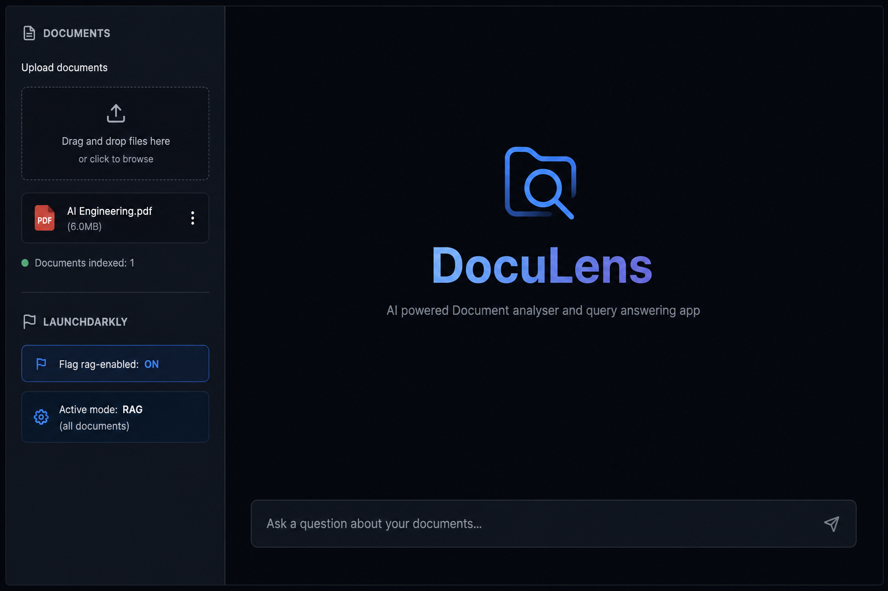
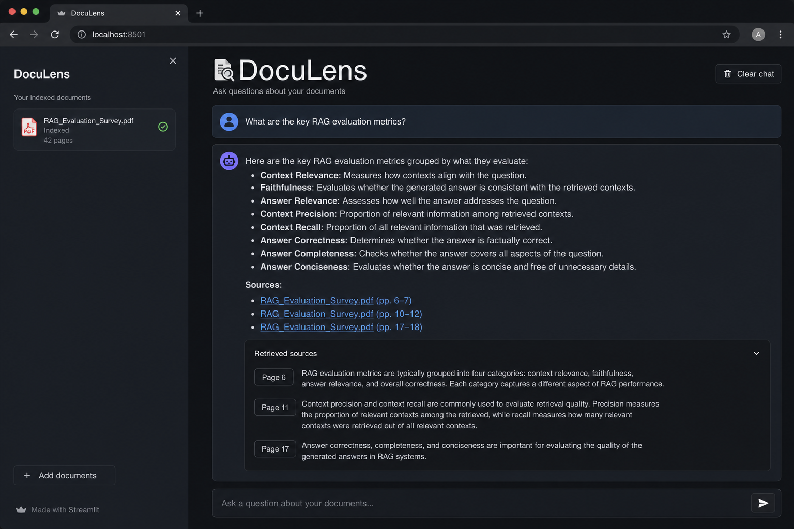

# DocuLens

**AI powered Document analyser and query answering app**

Upload your PDFs or text files, ask questions in plain English, and get answers backed by your documents—with citations pointing to the exact sources.

## Screenshots

### Upload documents & choose mode



Upload one or more files in the sidebar. The app indexes them automatically. LaunchDarkly controls whether you search **all documents (RAG)** or only the **latest upload**.

### Ask questions & view sources



Type a question in the chat. DocuLens retrieves relevant passages and answers with a **Sources** section so you can verify every claim.

## What you can do

- Upload multiple **PDF** and **TXT** files
- Ask natural-language questions about your content
- Get answers with **page-level citations**
- Switch between **RAG** (all files) and **single-document** mode via LaunchDarkly flag `rag-enabled`

## How to use

1. **Start the app** (see [Setup](#setup) below).
2. **Upload** your documents from the left sidebar.
3. Wait for indexing to finish (progress appears for larger files).
4. **Ask a question** in the chat box at the bottom.
5. Expand **Retrieved sources** to see which pages were used.

**RAG vs non-RAG**

| `rag-enabled` | Behavior |
|---------------|----------|
| ON | Searches across **all** uploaded documents |
| OFF | Searches only the **most recently uploaded** file |

The current mode is shown in the sidebar under **LaunchDarkly**.

## Tech stack

| Layer | Technology |
|-------|------------|
| UI | Streamlit |
| LLM | NVIDIA NIM — Llama 3.1 8B Instruct |
| Embeddings | NVIDIA NIM — NV-Embed-v1 |
| Vector store | Chroma |
| Feature flags | LaunchDarkly |

## Setup

**Requirements:** Python 3.10+, NVIDIA API key, LaunchDarkly server SDK key.

```bash
git clone https://github.com/Ankita123-sys/DocuLens.git
cd DocuLens

python3 -m venv .venv
source .venv/bin/activate
pip install -r requirements.txt

cp .env.example .env
```

Add your API keys to `.env`, then run:

```bash
streamlit run app.py
```

Open **http://localhost:8501** in your browser.

## License

MIT
